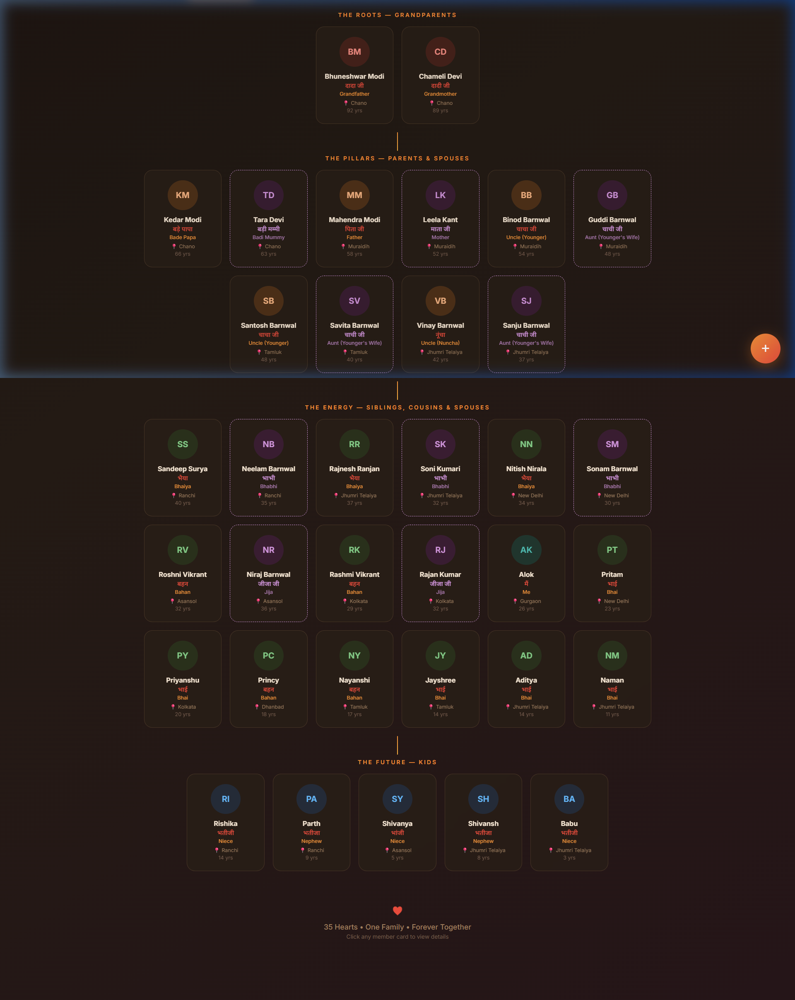

# 🌳 Modi-Barnwal Family Portal

A beautiful, interactive, and culturally-rich family management application designed to keep the Modi-Barnwal family connected across generations.

## ✨ Key Features

- **Interactive Family Tree:** Visualize the entire family across four generations (Grandparents to Kids).
- **Cultural Terminology:** Personalized relationship labels in Hindi (e.g., *Bhaiya*, *Bade Papa*, *Badi Mummy*, *Nuncha*).
- **Birthday Hub:** 
  - Dynamic **"Today's Special"** spotlight banner for active birthdays.
  - Dedicated **Birthdays Calendar** grouped by month.
  - Automatic countdowns for upcoming celebrations.
- **Memories Gallery:** A rich collection of family photos with event-specific captions.
- **Interactive Map:** See where family members are located across India (Ranchi, Delhi, Kolkata, etc.).
- **Milestone Timeline:** A chronological journey of the family's history.
- **Premium Aesthetics:** Sleek dark mode with vibrant accents and smooth animations.

## 🛠️ Tech Stack

- **Core:** React.js + Vite
- **Styling:** Vanilla CSS (Glassmorphism & Festive Theme)
- **Deployment:** Vercel
- **Data Management:** LocalStorage with Version Control (Auto-syncing)

## 🚀 Getting Started

1. Clone the repository.
2. Install dependencies: `npm install`
3. Start the dev server: `npm run dev`
4. Build for production: `npm run build`

---
*Created with ♥ for the Modi-Barnwal Family.*
