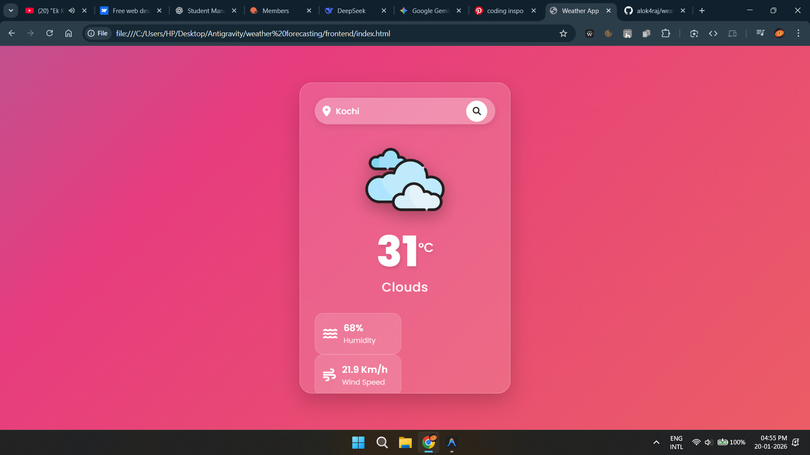

# Weather Forecasting Web Application

A responsive, full-stack weather application built with **Spring Boot** (Backend) and **Vanilla HTML/CSS/JS** (Frontend).

## 🚀 Features

- **Real-time Weather**: Fetches current weather data for any city.
- **Detailed Metrics**: Displays temperature (°C), humidity, wind speed, and weather condition.
- **Responsive Design**: Glassmorphism UI that adapts to Mobile, Tablet, and Desktop screens.
- **Error Handling**: User-friendly error messages for invalid cities or API failures.

## 🛠️ Technology Stack

- **Backend**: Java 17, Spring Boot 3.2.2, Spring Web, RestTemplate, Lombok
- **Frontend**: HTML5, CSS3 (Flexbox/Grid), JavaScript (ES6+), FontAwesome

## ⚙️ Setup & Installation

### Prerequisites

- Java 17 or higher
- Maven
- Basic web browser

### Backend Setup

1.  **Clone/Download** the repository.
2.  Navigate to the `backend` directory.
3.  Open `src/main/resources/application.properties` and ensure your API key is set:
    ```properties
    weather.api.key=YOUR_ACTUAL_API_KEY
    ```
    *(Get a free key from [WeatherAPI.com](https://www.weatherapi.com/))*
4.  **Run the application**:
    ```bash
    mvn spring-boot:run
    ```
    The server will start at `http://localhost:8080`.

### Frontend Setup

1.  Navigate to the `frontend` directory.
2.  Open `index.html` in any web browser.
3.  Enter a city name and hit search!

## 📡 API Endpoints

- **GET** `/api/weather/{city}`
  - **Description**: Fetches current weather for the specified city.
  - **Response**:
    ```json
    {
      "city": "London",
      "temperature": 15.0,
      "humidity": 72,
      "condition": "Cloudy",
      "windSpeed": 12.5
    }
    ```

## 📸 Screenshots

*(Add screenshots here after running the app)*

